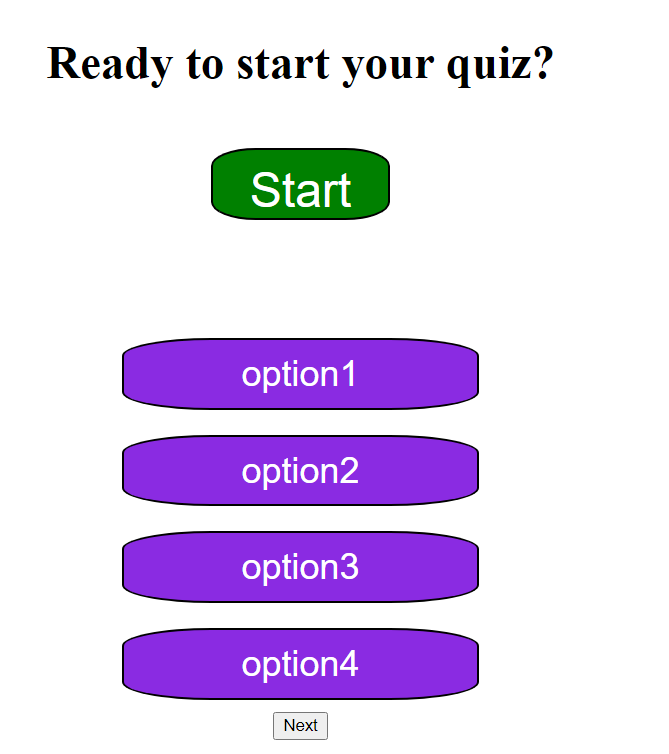

# passwordGenerator

📖Weekly Challenge 4
Implemented the following user story:

## User Story

AS A coding boot camp student
I WANT to take a timed quiz on JavaScript fundamentals that stores high scores
SO THAT I can gauge my progress compared to my peers

## Acceptance Criteria
GIVEN I am taking a code quiz
WHEN I click the start button
THEN a timer starts and I am presented with a question
WHEN I answer a question
THEN I am presented with another question
WHEN I answer a question incorrectly
THEN time is subtracted from the clock
WHEN all questions are answered or the timer reaches 0
THEN the game is over
WHEN the game is over
THEN I can save my initials and score

## About the site

When the button is clicked you will be prompted if you want to customize the password. If you click cancel it will generate a random password with a random length. If you click "ok" to customize the password you will be prompted to choose the length and what characters are allowed. 

## Assets

The URL is: https://rikrox.github.io/passwordGenerator/

Repository located at: https://github.com/RikRox/passwordGenerator
